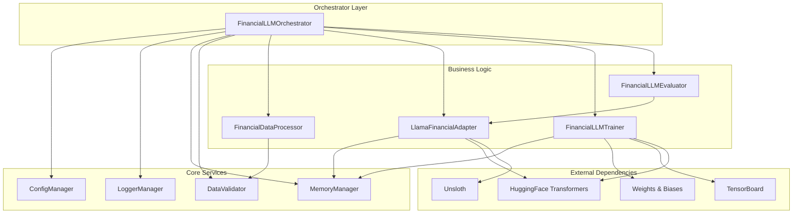
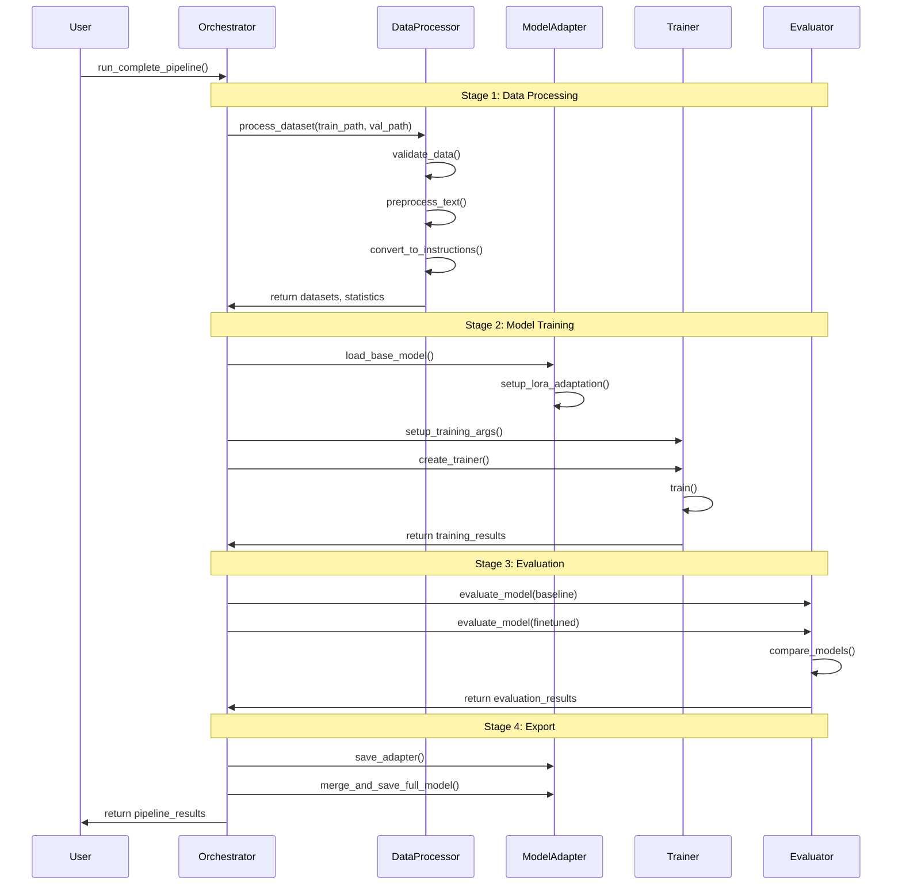
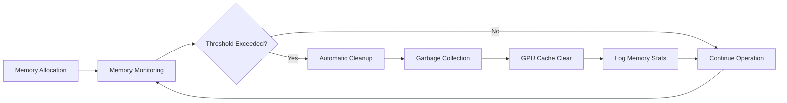

# Financial LLM Fine-tuning Framework - Architecture Documentation

## Table of Contents
1. [Overview](#overview)
2. [System Architecture](#system-architecture)
3. [Core Components](#core-components)
4. [Design Patterns](#design-patterns)
5. [Data Flow](#data-flow)
6. [Scalability Considerations](#scalability-considerations)
7. [Security Architecture](#security-architecture)
8. [Performance Optimization](#performance-optimization)

## Overview

The Financial LLM Fine-tuning Framework is an enterprise-grade system designed for domain-specific fine-tuning of large language models on financial data. The architecture emphasizes modularity, scalability, maintainability, and robust error handling.

### Key Design Principles

1. **Separation of Concerns**: Clear separation between data processing, model management, training, and evaluation
2. **Dependency Injection**: Configurable components with loose coupling
3. **Single Responsibility**: Each module has a clearly defined, singular purpose
4. **Open/Closed Principle**: Extensible architecture without modifying existing code
5. **Interface Segregation**: Small, focused interfaces
6. **Dependency Inversion**: Depend on abstractions, not concretions

## System Architecture

### High-Level Architecture

```
┌─────────────────────────────────────────────────────────────────┐
│                        Financial LLM Framework                  │
├─────────────────────────────────────────────────────────────────┤
│  🎯 Orchestrator Layer (main.py)                    │
│  ├─ Pipeline Coordination                                       │
│  ├─ Error Handling & Recovery                                   │
│  └─ Resource Management                                         │
├─────────────────────────────────────────────────────────────────┤
│  ⚙️  Core Services Layer                                        │
│  ├─ Configuration Management    ├─ Logging System              │
│  ├─ Memory Management          ├─ Validation Framework          │
│  └─ Statistical Analysis       └─ Performance Monitoring        │
├─────────────────────────────────────────────────────────────────┤
│  🔧 Business Logic Layer                                        │
│  ├─ Data Processing            ├─ Model Adaptation             │
│  ├─ Training Framework         └─ Evaluation System            │
├─────────────────────────────────────────────────────────────────┤
│  📊 Data Layer                                                  │
│  ├─ Dataset Loaders            ├─ Schema Validators            │
│  ├─ Preprocessing Pipeline     └─ Quality Assurance            │
├─────────────────────────────────────────────────────────────────┤
│  🤖 Model Layer                                                 │
│  ├─ Llama Adapter              ├─ LoRA/QLoRA Integration       │
│  ├─ Memory Optimization        └─ Inference Pipeline           │
├─────────────────────────────────────────────────────────────────┤
│  🛠  Infrastructure Layer                                       │
│  ├─ Hardware Abstraction       ├─ Resource Monitoring         │
│  ├─ Storage Management         └─ Deployment Utilities         │
└─────────────────────────────────────────────────────────────────┘
```

### Component Interaction Diagram



## Core Components

### 1. Configuration Management (`src/core/config.py`)

**Purpose**: Centralized, type-safe configuration management with environment-specific overrides.

**Key Features**:
- YAML-based configuration with validation
- Environment-specific overrides (local, kaggle, colab, production)
- Type-safe configuration classes
- Runtime configuration updates
- Configuration persistence

**Design Pattern**: Singleton with Factory Method

```python
# Configuration hierarchy
ConfigManager
├─ ModelConfig (LoRA params, quantization settings)
├─ TrainingConfig (hyperparameters, optimization)
├─ DataConfig (preprocessing, validation rules)
└─ EvaluationConfig (metrics, generation params)
```

### 2. Data Processing Pipeline (`src/data/processor.py`)

**Purpose**: Advanced data processing with validation, preprocessing, and instruction formatting.

**Key Features**:
- Multi-template instruction formatting
- Comprehensive data quality validation
- Statistical analysis and reporting
- Memory-efficient processing
- Financial domain-specific preprocessing

**Design Pattern**: Strategy Pattern for instruction templates

```python
# Processing pipeline
FinancialDataProcessor
├─ InstructionTemplate (Strategy Interface)
│  ├─ FinancialUnderstandingTemplate
│  ├─ TranscriptionCompletionTemplate
│  ├─ ContentSummarizationTemplate
│  └─ QAGenerationTemplate
├─ DataStatistics (Value Object)
└─ DataValidator (Composition)
```

### 3. Model Adaptation (`src/models/llama_adapter.py`)

**Purpose**: Advanced Llama model adapter with QLoRA optimization and memory management.

**Key Features**:
- Unsloth integration for accelerated training
- QLoRA/LoRA configuration management
- Memory optimization strategies
- Model export and deployment utilities
- Comprehensive metrics tracking

**Design Pattern**: Adapter Pattern with Builder

```python
# Model adaptation layers
LlamaFinancialAdapter
├─ Base Model Loading (HuggingFace/Unsloth)
├─ LoRA Adaptation (PEFT integration)
├─ Memory Optimization (gradient checkpointing, etc.)
├─ Model Export (adapter, merged model)
└─ Metrics Tracking (parameters, memory usage)
```

### 4. Training Framework (`src/training/trainer.py`)

**Purpose**: Enterprise-grade training with monitoring, checkpointing, and fault tolerance.

**Key Features**:
- Comprehensive monitoring and logging
- Advanced callbacks for memory management
- Integration with W&B and TensorBoard
- Automatic checkpoint management
- Performance optimization

**Design Pattern**: Template Method with Observer

```python
# Training architecture
FinancialLLMTrainer
├─ TrainingArguments (Configuration)
├─ AdvancedTrainingCallback (Observer)
│  ├─ Memory monitoring
│  ├─ Performance tracking
│  └─ Metric logging
├─ Model optimization
└─ Export utilities
```

### 5. Evaluation System (`src/evaluation/evaluator.py`)

**Purpose**: Comprehensive evaluation with multiple metrics and statistical analysis.

**Key Features**:
- Multiple evaluation metrics (ROUGE, BLEU, BERTScore, semantic similarity)
- Financial domain-specific metrics
- Statistical significance testing
- Comparative analysis with visualization
- Bayesian analysis support

**Design Pattern**: Strategy Pattern with Template Method

```python
# Evaluation framework
FinancialLLMEvaluator
├─ MetricCalculator (Strategy aggregator)
│  ├─ ROUGE scoring
│  ├─ BLEU scoring
│  ├─ Semantic similarity
│  └─ Financial domain metrics
├─ StatisticalAnalyzer (Composition)
└─ Visualization utilities
```

## Design Patterns

### 1. Dependency Injection

Configuration and dependencies are injected rather than hard-coded:

```python
# Instead of hard-coded dependencies
class BadTrainer:
    def __init__(self):
        self.config = Config()  # Hard dependency
        self.logger = Logger()  # Hard dependency

# Dependency injection approach
class GoodTrainer:
    def __init__(self, config: TrainingConfig, logger: Logger):
        self.config = config    # Injected dependency
        self.logger = logger    # Injected dependency
```

### 2. Strategy Pattern

Different instruction templates and evaluation metrics:

```python
class InstructionTemplate(ABC):
    @abstractmethod
    def format(self, transcript: str) -> Dict[str, str]:
        pass

class FinancialUnderstandingTemplate(InstructionTemplate):
    def format(self, transcript: str) -> Dict[str, str]:
        # Financial analysis specific formatting
        pass
```

### 3. Observer Pattern

Training callbacks for monitoring:

```python
class TrainerCallback:
    def on_step_end(self, args, state, control, **kwargs):
        # Update observers (memory monitor, logger, etc.)
        pass
```

### 4. Factory Pattern

Configuration creation with environment-specific settings:

```python
def get_config_manager(config_path: str, environment: str) -> ConfigManager:
    # Factory method that creates appropriate configuration
    return ConfigManager(config_path, environment)
```

## Data Flow

### Training Pipeline Data Flow



### Memory Management Flow



## Scalability Considerations

### 1. Horizontal Scaling

**Data Processing**:
- Chunk-based processing for large datasets
- Parallel instruction template generation
- Distributed validation pipelines

**Model Training**:
- Multi-GPU support through PyTorch DDP
- Gradient accumulation for effective large batch sizes
- Checkpointing for fault tolerance

### 2. Vertical Scaling

**Memory Optimization**:
- Gradient checkpointing
- Mixed precision training (FP16/BF16)
- QLoRA for reduced memory footprint
- Dynamic batch sizing

**Compute Optimization**:
- Flash Attention 2 integration
- Model compilation (PyTorch 2.0)
- Optimized data loading with prefetching

### 3. Storage Scaling

**Data Management**:
- Compressed dataset storage
- Lazy loading for large datasets
- Incremental processing capabilities

**Model Storage**:
- Efficient checkpoint management
- Model sharding for large models
- Compressed export formats

## Security Architecture

### 1. Data Security

**Input Validation**:
- Comprehensive data validation pipeline
- Schema enforcement
- Content sanitization

**Data Privacy**:
- No sensitive data logging
- Secure temporary file handling
- Memory cleanup after processing

### 2. Model Security

**Access Control**:
- Environment-based configuration
- Secure model storage
- Access logging

**Export Security**:
- Secure model serialization
- Integrity checks
- Controlled deployment

### 3. Infrastructure Security

**Dependency Management**:
- Pinned dependency versions
- Security vulnerability scanning
- Isolated environments

**Logging Security**:
- Structured logging without sensitive data
- Log rotation and retention policies
- Secure log transmission

## Performance Optimization

### 1. Training Optimizations

**Memory Efficiency**:
```python
# Gradient checkpointing
model.gradient_checkpointing_enable()

# Mixed precision training
with autocast():
    outputs = model(inputs)

# QLoRA quantization
quantization_config = BitsAndBytesConfig(
    load_in_4bit=True,
    bnb_4bit_compute_dtype=torch.float16
)
```

**Compute Efficiency**:
```python
# Model compilation
if hasattr(torch, 'compile'):
    model = torch.compile(model, mode="reduce-overhead")

# Flash Attention
model.config.use_flash_attention_2 = True
```

### 2. Data Processing Optimizations

**Parallel Processing**:
```python
# Parallel tokenization
tokenized_datasets = datasets.map(
    tokenize_function,
    batched=True,
    num_proc=4  # Parallel processing
)
```

**Memory Management**:
```python
# Lazy loading
dataset = load_dataset("csv", data_files=files, streaming=True)

# Batch processing
for batch in dataset.iter(batch_size=1000):
    process_batch(batch)
```

### 3. Evaluation Optimizations

**Concurrent Evaluation**:
```python
# Parallel metric calculation
with ThreadPoolExecutor(max_workers=4) as executor:
    future_to_metric = {
        executor.submit(calculate_metric, pred, ref): metric_name
        for metric_name, (pred, ref) in metric_pairs.items()
    }
```

**Caching Strategies**:
```python
# Cache sentence embeddings
@lru_cache(maxsize=10000)
def get_sentence_embedding(text: str) -> np.ndarray:
    return sentence_model.encode(text)
```

### 4. Infrastructure Optimizations

**Resource Monitoring**:
- Real-time memory monitoring
- GPU utilization tracking
- Automatic resource cleanup

**Adaptive Configuration**:
- Dynamic batch size adjustment
- Memory-based parameter tuning
- Environment-specific optimizations

## Future Enhancements

### 1. Distributed Training

**Multi-Node Support**:
- Distributed data parallel training
- Model parallel training for larger models
- Fault-tolerant distributed training

### 2. Advanced Evaluation

**Human Evaluation Integration**:
- Human feedback collection framework
- RLHF (Reinforcement Learning from Human Feedback)
- Active learning for data selection

### 3. Production Deployment

**Model Serving**:
- FastAPI-based inference server
- Model versioning and A/B testing
- Monitoring and alerting

**MLOps Integration**:
- CI/CD pipelines for model training
- Automated model validation
- Production monitoring dashboards

This architecture provides a solid foundation for enterprise-grade financial LLM fine-tuning while maintaining flexibility for future enhancements and scaling requirements.